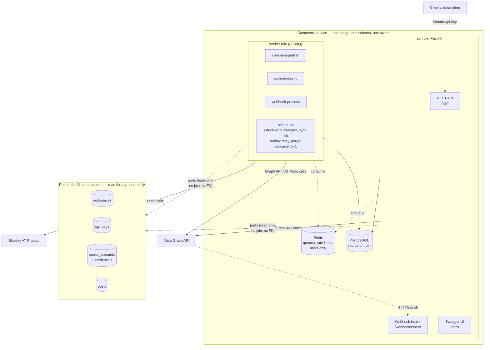
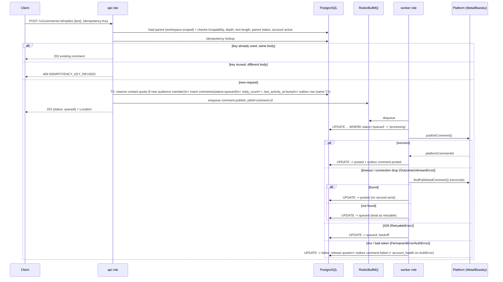
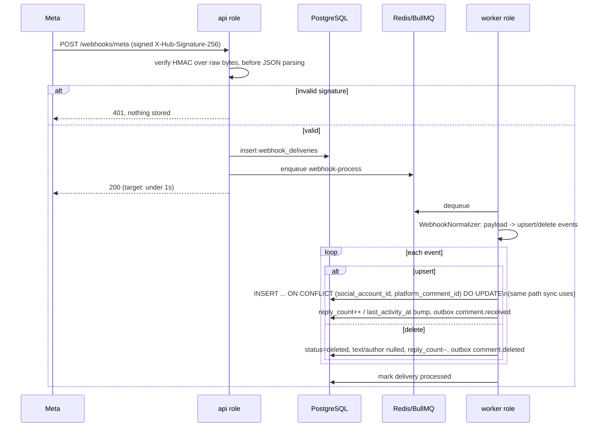
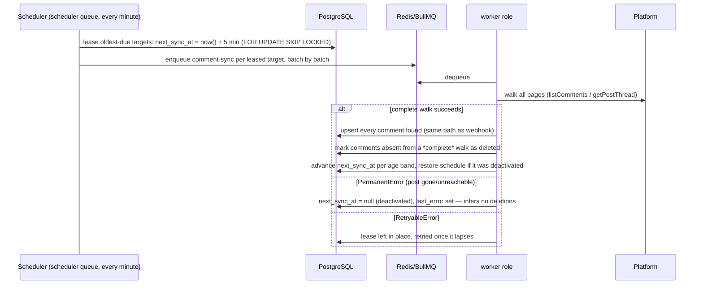

# Design

What the service is, how it's shaped, what it stores, what it exposes, how the three hot paths run,
how a platform gets added, why each non-obvious call was made, and what's unfinished.

`spec.md` is the source of truth for every decision (`D#`), assumption (`A#`) and spike (`S#`) cited
here; this document exists because `spec.md` is too granular to read end to end and come away with
the shape of the thing.

## 1. Context and scope

Blotato schedules posts across social platforms. This service is the part that, once a post is
published, lets a client or an automation read the comments under it and reply — across platforms
that behave nothing alike: Instagram and Facebook push events and cap nesting at one reply level;
Bluesky has no push channel and allows arbitrarily deep threads.

[`task.md`](./task.md) asked for four things: a database schema, an API design, working TypeScript,
and the reasoning behind the choices. Scope follows Blotato's own documented comment feature
(Instagram + Facebook, `spec.md` §2.1) plus one platform chosen because it violates every assumption
the other two satisfy (D7) — which is what actually tests whether the abstraction holds.

Out of scope by decision (§14): the OAuth connect flow and account management (another service's
job); private replies and DMs; moderation (hide/unhide, likes, edit); media attachments; adapters for
the other six platforms; Jetstream, partitioning, tracing, multi-region.

## 2. Architecture

One service, deployed on its own, with two runtime roles sharing one image, one schema and one
release (D1, D6, §4.1):



**The service boundary.** `workspaces`, `api_keys`, `social_accounts` and `posts` belong to other
services. This service keeps a read-only local projection of them (D8) so the hot paths —
authenticating a key, resolving a post, loading an account — don't make a network call per request.
In this deployment the projection is filled by the seed script; in the real platform, by events from
the owning services.

The rule that makes this a boundary rather than a convenience: **no foreign key and no SQL join**
from `comments` into those tables (D29). `workspace_id`, `social_account_id` and `post_id` are plain
`uuid` columns, validated on write by calling the port, not by a constraint. Even the one path that
looks like an exception — an `AuthError` "disconnecting" an account — writes this service's *own*
`account_health` table and emits an outbox event for the accounts service to act on; it never writes
`social_accounts.status` (D30).

**Why not two deployables.** The argument against splitting `api` and `worker` is not that it would
be slower — it's that no scaling profile, availability requirement or team boundary differs between
them today. They share a schema, a release and an owner regardless of how many processes run them, so
a second deployable buys only operational overhead. The one trigger that would change this is named
in `spec.md` §4.1: a webhook burst large enough that intake must stay available while publishing is
degraded. That is a genuinely different availability requirement, and it would make webhook intake
its own deployable writing to the same `webhook_deliveries` table — an extraction, not a rewrite.

## 3. Data model


`workspaces`, `api_keys`, `social_accounts` and `posts` are the read-only projection; everything else
is owned by this service. The `FK` labels inside the `comments` family are real Postgres foreign
keys; every `uuid` labeled "external ref" is a plain column with no constraint. That split is the
service boundary made visible in SQL.

Full column lists, constraints and indexes are in
[`specs/001-multi-platform-comments/data-model.md`](./specs/001-multi-platform-comments/data-model.md).

**Three constraints carry correctness, not application code alone:**

- `UNIQUE (social_account_id, platform_comment_id) WHERE platform_comment_id IS NOT NULL` — one row
  per platform comment, whichever of the three channels (API write settling, webhook, sync)
  discovers it first. This is also what resolves the webhook-echo race in §5.1.
- `UNIQUE (workspace_id, idempotency_key) WHERE idempotency_key IS NOT NULL` — a retried client
  request cannot create a second comment.
- `CHECK (status <> 'posted' OR platform_comment_id IS NOT NULL)` — a comment cannot claim to be
  published without the identifier that proves it.

## 4. API

Base path `/v1`, JSON, `camelCase`, auth via the `blotato-api-key` header (A16 — the name Blotato's
existing public API uses, so clients reuse their settings). Errors are RFC 9457
`application/problem+json` with a machine-readable `code`.

| Method & path | Purpose |
|---|---|
| `GET /v1/comments` | The workspace's comments, filtered by `postId`, `parentCommentId`, `accountId`, `platform` (repeatable), `topLevelOnly`, `isOwn`, `since`/`until` — filters intersect (D31) |
| `GET /v1/comments/:commentId` | Poll a single comment (the async-write polling target) |
| `POST /v1/posts/:postId/comments` | Start a top-level thread — `202`, not `201` |
| `POST /v1/comments/:commentId/replies` | Reply to a comment — `202`, not `201` |
| `POST /v1/posts/:postId/comments/sync` | Request an out-of-band refresh |
| `GET /v1/comment-sync-jobs/:jobId` | Poll a refresh job |
| `GET /v1/platforms` | The capability registry, all nine platforms |
| `GET`/`POST /webhooks/meta` | Meta event intake — handshake and signed delivery (§5.2) |
| `GET /healthz`, `GET /readyz` | Liveness / readiness |
| `GET /docs`, `GET /openapi.json` | Swagger UI and the generated document |

`GET /v1/comments` replaces three former nested reads — `GET /v1/posts/:postId/comments`,
`GET /v1/comments/:commentId/replies` and `GET /v1/accounts/:accountId/comments` — each reproduced as
a filter on the one collection; the three addresses now answer `404`. `sync: { lastSyncedAt,
activeJobId }` is present iff `postId` is named.

An unrecognized *parameter name* is a `400`, not a silently dropped filter: on a read where every
parameter narrows the result, `?post_id=…` answering `200` with the whole workspace is
indistinguishable from a wrong answer.

Full request/response shapes are in
[`contracts/rest-api.md`](./specs/001-multi-platform-comments/contracts/rest-api.md) and the
generated [`openapi.json`](./openapi.json).

### 4.1 Why reads flattened and writes didn't (D31)

- **One filtered collection, because a capability was missing — not for discoverability.** "Every
  new comment across every account in the workspace" had no address at all under the three nested
  reads: a moderator watching the whole workspace had to fan out to every post's route and stitch the
  pages together client-side. That's a missing capability, not an ergonomics complaint.
- **Writes stay addressed to their target.** Commands address a specific thing they act on; queries
  filter a set they select from. Collapsing a write into a body field (`POST /v1/comments { postId
  }`) would trade a URL any HTTP tool can retry and log unambiguously for one more field to validate,
  with no compensating benefit — there is exactly one target, known before the call. The refresh
  command stays post-addressed for the same reason: a sync walk always has exactly one target.
- **`topLevelOnly` is a filter, not a route.** The removed `GET /v1/posts/:postId/comments`
  implicitly meant "this post's top-level comments"; `?postId=…&topLevelOnly=true` says it
  explicitly. It is also what keeps the partial index `comments_post_top_level_idx` (defined `WHERE
  parent_comment_id IS NULL`) reachable — without the flag the predicate cannot match the index's
  condition and the planner falls back to a broader index or a scan.

**Ordering and NULL placement.** A Postgres pathkey includes NULL placement, not just direction, and
the planner does not use a column's `NOT NULL` to match one. So an index and the query's `ORDER BY`
must agree textually or the index stops supplying the ordering. Both sides therefore name *no*
placement and stay at Postgres's default for the direction (`NULLS FIRST` for `DESC`, `NULLS LAST`
for `ASC`; migration `0005`). Each index then reads forwards for its own direction and backwards for
the other, which is what makes `order` a free parameter rather than one cheap value and one
expensive one. Naming `NULLS LAST` on a `DESC` index instead costs `order=asc` that index entirely —
its backward scan yields `ASC NULLS FIRST` — and the read degrades to a full `Sort`.
`benchmark.integration.test.ts` asserts the whole selection × direction matrix through `EXPLAIN`,
because a test covering only each index's declared direction passes on exactly the half that works.

**Listing cost (SC-005, `pnpm bench:listing`).** The unfiltered `GET /v1/comments` measured p95
3.95 ms against a 10,000-comment workspace and 3.01 ms against a 100,000-comment one — ratio 1.31,
under the 1.5 pass line. Measured in-process (`app.inject`, no network layer) on a laptop, so the
absolute numbers are indicative; the ratio is the claim. The harness detects a regression whose cost
scales with the queried workspace's own history — the `NULLS LAST` mismatch above reproduces at
ratio ~4.5 — and structurally cannot detect one scaling with total table size, since both seeded
workspaces share a table.

## 5. Flows

### 5.1 Reply to a comment (also covers starting a top-level thread)



**Reconciliation happens before any retry that follows an ambiguous outcome.** A send that times out
or drops the connection may or may not have landed; retrying blindly risks a second public reply on a
brand's behalf, which D14 treats as strictly worse than a delay. `findPublishedComment` resolves the
ambiguity by asking the platform whether our comment is already there (same author, same text, created
no earlier than `last_attempt_started_at − 2 min`) before deciding to retry.

Two refinements the implementation forced, both in `spec.md` §18:

- **A 5xx on a *write* is an unknown outcome, not a retryable one.** The request reached the
  platform, so the comment may exist behind it. Classifiers take the operation kind: `>= 500` maps to
  `OutcomeUnknownError` on a write, stays `RetryableError` on a read. A 429 is retryable either way —
  a rate-limit rejection was never executed.
- **The reconciliation guard is persisted, not held in the failing attempt's stack.** A worker killed
  between the platform accepting the write and this service committing `posted` would otherwise be
  recovered by the sweeper with nothing recorded about the send that may have gone out.
  `comments.needs_reconcile` is set in its own transaction immediately before the adapter call and
  cleared only by a settled outcome or a completed search.

**The webhook-echo race.** If ingestion has already inserted the same comment — Meta reflects
published comments back through its own feed — before the worker's `UPDATE ... SET
platform_comment_id` runs, that update collides with the unique dedup key. The fix is not a retry
loop: one transaction deletes the ingested duplicate and lets the original API-created row win, so
the `reply_count` and `last_activity_at` bookkeeping already done on the duplicate doesn't
double-count.

### 5.2 Webhook ingestion (Meta)



Webhook and sync ingestion share one upsert path (`ingest-comments.ts`) specifically so this
diagram's `INSERT ... ON CONFLICT` is the same code either channel runs — a correctness property
(D4's dedup key) that would be easy to lose if written twice.

A delivery identifies its account by the platform's own id — a Page id or IG user id — not by our
`social_account_id`, and the `Accounts` port therefore resolves it with
`listByPlatformAccount(platform, platformAccountId)`. It returns a **list**: the projection carries
no uniqueness on that pair and none can be assumed, since two workspaces may legitimately connect the
same Page. A single-record lookup would serve one workspace and silently drop the other's comments.

### 5.3 Sync (backfill, reconciliation, Bluesky polling)



**Only a complete walk may infer a deletion.** A partial walk — one page fetched, then an error —
has only negative evidence for the pages it never reached, and treating "didn't get there" as "not
there" would delete real comments. `PermanentError` gets the same treatment: the post being gone is
not a statement about its comments, and the walk that discovered it is by construction not complete.

"Complete" additionally excludes rows written in the last five minutes. A comment inserted *while*
the walk ran — a reply this service just published, a webhook delivery, a comment the platform had
not yet indexed — is absent from the page through no fault of the platform, and absence is what marks
it deleted. The cost of the grace window is that a genuinely deleted comment edited in that window
survives until the next walk; the cost without it was an irreversible false deletion.

## 6. Platforms and the registry

All nine platforms Blotato publishes to have an entry in `src/platforms/registry.ts`; three carry
comment support:

| Platform | Top-level | Reply | `maxReplyDepth` | Text limit | Ingestion |
|---|---|---|---|---|---|
| Instagram | yes | yes | 1 | 2200 characters | webhook + sync (no real deliveries under D23, §9) |
| Facebook | yes | yes | 1 | 8000 characters | webhook + sync (no real deliveries under D23, §9) |
| Bluesky | yes | yes | unbounded (`null`) | 300 graphemes | sync (polling — no push channel exists) |
| threads, x, linkedin, youtube, tiktok, pinterest | — | — | — | — | — (`unsupportedReason` set) |

The registry is the *only* place a use case learns a platform difference — depth checks, text limits
and their counting unit (characters vs. graphemes via `Intl.Segmenter`), whether a write is possible
at all. No use case contains a `switch (platform)`. Refresh cadence follows the same rule: an entry
names a `syncIntervalGroup` rather than the scheduler branching on platform.

**Adding a platform** means implementing four methods and adding one registry row —
**no migration, no REST contract change**:

```ts
interface CommentPlatformAdapter {
  readonly platform: Platform;
  listComments(ctx, target, cursor?): Promise<CommentPage>;
  publishComment(ctx, input): Promise<PublishedComment>;
  findPublishedComment(ctx, probe): Promise<PublishedComment | null>;
  fetchComment(ctx, platformCommentId): Promise<NormalizedComment | null>;
}
```

— raising the four typed errors (`RetryableError`, `OutcomeUnknownError`, `PermanentError`,
`AuthError`) where they apply. Bluesky is the proof rather than the claim: unbounded nesting where
Meta has one level, graphemes where Meta counts UTF-16 characters, no push channel at all — three
axes of difference, zero new branches in `comments/application` or `comments/http`.

**Meta.** Two login variants serve the same product surface (D28): `facebook_login` (long-lived Page
token, `graph.facebook.com`, covering the linked IG professional account) and `instagram_login`
(long-lived Instagram user token, `graph.instagram.com`, `instagram_business_manage_comments`). The
endpoint shapes are identical; only host and token selection differ, and that lives entirely inside
`graph-client.ts` — no adapter, use case or route reads `auth_variant`. The two also disagree on
author fields: Facebook's `from` carries `{id, name}`, Instagram's `{id, username}`, so
`author_username` is null for Facebook and `author_display_name` null for Instagram. Both
normalizations are load-bearing.

**Bluesky.** `platform_post_id`/`platform_comment_id` are AT URIs; `cid` lives in `platform_meta`
because replying needs both. Deletion has two signals: a `notFoundPost` tombstone in a returned
thread is explicit, and `CommentPage` carries those ids in a field *separate* from `comments`
(`deletedPlatformCommentIds`) — returning a tombstone as an ordinary comment would upsert it as
`posted` and, worse, record it as *seen*, suppressing the absence-based deletion the complete walk
would otherwise detect. Absence still needs a complete walk, same as Meta.

## 7. Key decisions and what was rejected

**Ingestion: webhook primary, sync for backfill and reconciliation (D4).** Push alone can't recover a
missed event, and Blotato's product has no backfill — connecting an account captures nothing
retroactive. The rejected alternative was sync-only: simpler, but push-to-readable latency becomes
the polling interval (up to 30 minutes for Meta under 24h) instead of a webhook round trip, failing
SC-004's freshness target for no reason other than avoiding two code paths. Sharing one upsert
function between the channels is what keeps that choice from costing a second place to get dedup
wrong.

**Reconciliation before retry, not retry-then-reconcile (D14).** Classifying an ambiguous send as
merely "retryable" is the single mistake that produces a duplicate public reply on a brand's behalf.
The four-way error taxonomy exists to keep "definitely not sent" (`RetryableError`) and "sent,
outcome unknown" (`OutcomeUnknownError`) from collapsing into one bucket; only the second calls
`findPublishedComment` first.

**`202`, not `201`, on every write (A11).** Blotato's existing `/v2/comments` returns `201` — true in
the sense that the row exists. `202` says something truer for this design: the *platform* hasn't
acted, and the client's next move is to poll, not to trust the body as final state. The trade-off is
an extra round trip when publishing succeeds in under a second. The alternative — `201` with a
synchronous publish attempt — makes request latency equal platform latency, breaking the
write-acknowledgment budget (SC-006) and reintroducing the double-post risk synchronously instead of
behind a queue with retries.

**No foreign key across the service boundary (D29).** A foreign key from `comments.workspace_id` into
another service's `workspaces` table forces a shared database — the exact coupling a service boundary
exists to avoid. It blocks either side from migrating independently and makes "which service owns
this row" a question the schema can no longer answer. The cost is that referential integrity comes
from port validation on write and platform events on delete rather than from the database; accepted
explicitly, because the read contract needs no data from those tables that a stale or missing
projection row can't already report as "unknown, 404".

**`account_health`, not a write to `social_accounts.status` (D30).** The natural implementation of
"mark the account disconnected" is one `UPDATE` — and it makes this service a second writer of
another service's data, the one boundary violation the design exists to avoid. Instead this service
owns `account_health`, records `auth_failed` on an `AuthError`, emits `account.auth_failed`, and the
`Accounts` port computes an **effective** status (`active` only if the projection says `active` *and*
no local `auth_failed` row exists). Every caller sees what the naive version would have produced,
without the write. Clearing it needs evidence rather than a status read — a *successful* platform
call proves the credential works again — so `AccountHealth.clear` is called from a successful sync
walk, and sync keeps running for an account marked `auth_failed` precisely to make that reachable.

**Keyset pagination with the order encoded in the cursor (D27).** Offset pagination shifts under
concurrent inserts — exactly SC-002's failure mode, and the inbox is a page a real user refreshes
while comments arrive. `(occurred_at, id)` makes the key total, ties broken by a time-sortable
UUIDv7; encoding the direction turns "replayed this cursor the other way" from a silent re-sort into
an explicit `400`. `occurred_at` is pinned to `timestamptz(3)` because the cursor encodes
`toISOString()` — a stored microsecond the cursor can't express makes paging lossy in both
directions, invisibly from TypeScript.

**`ContactQuota.reserve` takes the caller's transaction.** The first draft opened its own. That's
wrong the way any split-transaction "atomic" operation is wrong: a crash between the reservation's
commit and the comment insert's leaks a permanent allowance with no way back, because `release` is
keyed by a comment id that was never written.

**The outbox relay publishes in bulk and isolates a failing batch row by row (D9).** A pass locks
the oldest batch, publishes it with one `addBulk` and stamps it with one `UPDATE`, and keeps going
while batches come back full — so a backfill's thousands of events leave in one pass. Bulk alone
would let a single row BullMQ never accepts roll its batch back on every pass, sitting at the front
of the oldest-first selection and blocking every event behind it. A failed batch is therefore
retried with each row in its own transaction under `FOR UPDATE SKIP LOCKED`; a failing row
increments `attempts` and is logged, and the pass stops. The row is never deleted — the outbox is
the only record of the event — but past ten attempts the log level rises to `error`, which makes a
stuck event an incident rather than an invisible retry.

## 8. Assumptions

The full numbered list (A1–A23) is in `spec.md` §16. The ones that change what you'd expect from
reading the API alone:

- **A2 — "own" comment** is decided by author identity matching the connected account, not by
  channel: a comment created through this API and one ingested back through Meta's feed for the same
  author are both `isOwn: true`. This matters for DM automations, which must never fire on the
  brand's own comment.
- **A4 — deleted with replies.** A deleted comment that still has live replies is returned as a
  placeholder (`status: "deleted"`, `text: null`, author nulled) rather than omitted, because
  omitting it would orphan its replies. A deleted comment with no replies is simply absent.
- **A7 / A10a.** Top-level comments require an internal post; replies don't, because they're
  addressed by `commentId`. A comment outlives the `posts` row it points to by design:
  `platform_post_id` is the durable anchor adapters use, `post_id` only serves the `postId` filter,
  and a `posts` row that stops resolving turns *that filter* `404` without touching the comment's
  reachability through the unfiltered listing.
- **A9 — retention** is measured from the *thread's* last activity (`last_activity_at` on the root),
  not an individual comment's age: a 46-day-old top-level comment with a reply from yesterday is not
  purged.
- **A16 — the auth header** is `blotato-api-key`, matching Blotato's existing public API rather than
  inventing a name, so existing clients (n8n, Make, MCP) reuse their configured header.

## 9. Implementation status

**Built and tested** (unit + integration against testcontainers Postgres + Redis): the read model
(one filtered, keyset-paginated collection plus single-comment polling); the write path (top-level
and reply, idempotency, the full publish state machine including reconciliation and the webhook-echo
race); sync (backfill, reconciliation, deletion inference, manual refresh with cooldown); the
transactional outbox and relay; tenancy (404-not-403 on every endpoint and every identifier-shaped
filter); retention purge; the Bluesky adapter; the Meta read and write paths, written against a
recorded live response and exercised against `facebook_login` (the adapter does not branch on
variant — see the gap below); the capability registry and `GET /v1/platforms`; API-key auth and
per-key rate limiting; OpenAPI generation with a CI drift check.

**Deployed** at https://api-production-6ef5.up.railway.app (D24 — `api` and `worker` from one
Dockerfile, managed Postgres 18 and Redis 8.2, migrations as a pre-deploy command). All three
comment-capable platforms run live there against real accounts; README has the results.

**Four gaps:**

- **Real Meta webhook deliveries do not arrive.** Spike S1 established that a dashboard test send is
  delivered and a real user's comment is not, at this app's access level — confirming D23 (Standard
  Access, no App Review or Business Verification). The intake, verifier, normalizer and worker are
  built and tested against the recorded delivery, whose envelope is the one a real delivery carries;
  IG/FB data reaches the service through sync. S6 narrowed D23's consequence: Standard Access blocks
  webhook *delivery*, not Page reads — the Facebook comment reads that first looked blocked were two
  missing use-case permissions, not App Review.
- **The `instagram_login` variant is unverified.** S2 answered the `facebook_login` half and its raw
  response is committed as the fixture the adapter was written against. The other variant needs a
  second Meta App and was not attempted, so the two-variant equivalence test replays that one fixture
  on both hosts: it proves the adapter does not branch on variant and claims nothing about what
  `graph.instagram.com` returns. Which secret signs `instagram_login` webhook deliveries (S5) is
  likewise open — but it is a configuration value, not a code shape: the verifier accepts either
  configured secret.
- **A comment with more than one page of replies is not syncable.** Meta caps a nested edge and no
  spike exercised the truncated shape, so `listComments` throws rather than read a truncated reply
  set as a complete one — an incomplete walk infers no deletions. Loud degradation, deliberately,
  until that edge's paging is observed. Consequently a seeded Instagram refresh target fails on every
  scheduler tick, producing `failed` rows in `comment_sync_jobs`: expected, but worth knowing before
  reading the worker logs.
- **`domain-events` has no consumer.** The relay correctly drains Postgres to the BullMQ queue (D9),
  but nothing downstream consumes it in this deliverable and Redis runs `noeviction` by design, so
  jobs would accumulate without bound. A scheduled job therefore drops jobs older than
  `DOMAIN_EVENTS_TTL_HOURS` (default 24) and logs the count, the way a real broker expires
  uncollected messages. `outbox_events` rows stay in Postgres under the normal purge, so a future
  consumer is backfilled from the table rather than from Redis — which is the D9 property that
  matters.

## 10. Differences from Blotato's current `/v2/comments` (D3)

This is its own design, not an attempt to reproduce Blotato's — the brief is explicit that reasoning
is what's evaluated, not parity.

| `/v2/comments` (documented, `spec.md` §2.1) | This service | Why |
|---|---|---|
| `POST` returns `201` | `POST` returns `202` | The row exists; the platform hasn't acted yet. `201` would claim more than is true (§7). |
| One flat `GET /comments` with filters | Also one flat `GET /comments`, plus `topLevelOnly` and `isOwn` | **No longer a difference.** This service originally split by access pattern (three nested reads), reasoning that each wanted its own index and default order. That held until the product need turned out to be moderation across the whole workspace, which none of the three could answer without the client stitching pages together. The per-pattern indexes survived the change — only the addressing converged (D31). |
| No ordering parameter; implicitly `createdAt desc` | Explicit `order=asc\|desc`, encoded into the cursor | A client reading a conversation wants oldest-first; one watching an inbox wants newest-first. A single fixed order forces the client to accept the wrong one or reverse client-side, which breaks under pagination. |
| `createdAt` is the sort key | `occurredAt` is the sort key; `createdAt` means "when this row was written here" | An ingested comment's platform timestamp and an API-created comment's insertion time are not on the same clock. Sorting by insertion time puts a comment the platform says happened an hour ago ahead of one from five minutes ago, if the older one was ingested first. |
| 60/min reads, 30/min writes | 30/min reads, 5/min writes (demo default; a key's own limit can lower, never raise, this) | This deployment is a reviewer demo against real accounts, not a production tier. The mechanism — per key, not per IP — is the same idea: tie the budget to the credential. |
| Text limits not unit-specified | Registry states the limit *and* its counting unit | Necessary the moment a platform counts differently: Bluesky's 300 graphemes aren't 300 UTF-16 code units, and conflating them rejects valid text containing multi-code-unit emoji and accepts invalid text. |

## 11. Evolution path

Four things are designed to be added later, each with the reason it isn't now:

- **Jetstream for Bluesky (D17).** Adaptive polling is the one ingestion mechanism needing no
  stateful component. Jetstream would cut latency from "next poll tick" to seconds, at the cost of a
  long-lived connection this worker must supervise, reconnect and back-pressure — a different
  operational shape from "BullMQ jobs that run, finish and exit". Justified once polling latency is
  an actual complaint rather than a theoretical one.
- **Table partitioning (D15).** 45-day retention already bounds `comments`, and the purge deletes in
  batches of 1000 so it never holds one long transaction against the whole table. Partitioning by
  `occurred_at` becomes worth its migration complexity once those batched deletes are themselves the
  bottleneck — partitioning a table that isn't large yet only adds planning overhead.
- **The remaining six platforms.** Already in the registry with `supportsComments: false` and a
  reason. Each is an adapter plus a registry row the moment platform API access exists; none changes
  the schema or the REST contract, which is the entire point of the registry existing now rather than
  arriving with the first extra platform.
- **Private replies (D10).** Out of scope because they're a different domain — DMs, not comments —
  and Blotato's own DM Automations feature treats them that way. The seam left for that work is
  `isOwn` and `ingestionSource: "backfill"` on every ingested comment event: exactly the two facts a
  comment-triggered automation needs to decide whether to fire, without reading this service's
  storage directly.
