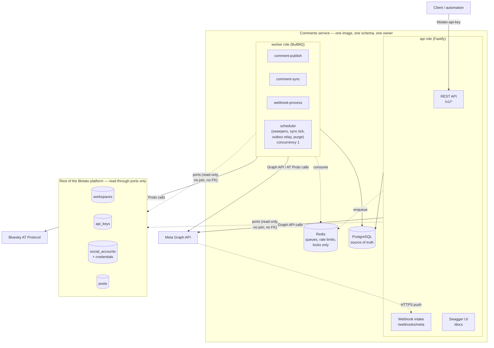
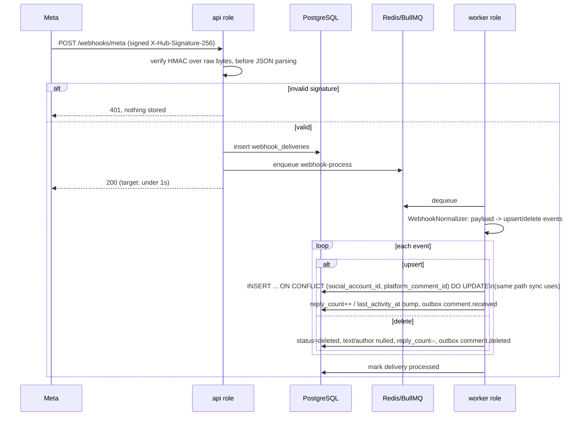
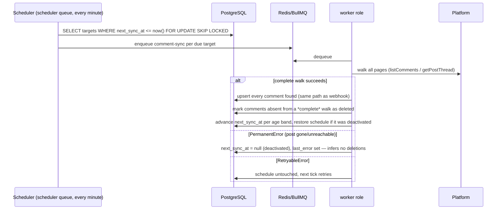

# Design

This is the reader's path through the system: what it is, how it's shaped, what it stores, what it
exposes, how the three hot paths actually run, how a platform gets added, why each non-obvious call
was made, and what's genuinely unfinished. `spec.md` (repository root) is the source of truth for
every decision (`D#`), assumption (`A#`) and spike (`S#`) cited below; this document exists because
`spec.md` is too granular to read end to end and still come away with the shape of the thing.

## 1. Context and scope

Blotato schedules posts across social platforms. This service is the part that, once a post is
published, lets a client (or an automation) read the comments under it and reply — across platforms
that behave nothing alike: Instagram and Facebook push events and cap nesting at one reply level;
Bluesky has no push channel at all and allows arbitrarily deep threads. The brief
([`task.md`](./task.md)) asked for four things: a database schema, an API design, working TypeScript
code, and the reasoning behind the choices. Scope follows Blotato's own documented comment feature
(Instagram + Facebook, §2.1 of `spec.md`) plus one platform chosen specifically because it violates
every assumption the other two satisfy (D7) — that's what actually tests whether the abstraction
holds.

Out of scope, by decision (§14): the OAuth connect flow and account management (another service's
job); private replies and DMs; moderation (hide/unhide, likes, edit); media attachments; adapters for
the other six platforms; Jetstream, partitioning, tracing, multi-region.

## 2. Architecture

One service, deployed on its own, with two runtime roles sharing one image, one schema and one
release (D1, D6, §4.1):



**The service boundary.** `workspaces`, `api_keys`, `social_accounts` and `posts` belong to other
services of the platform. This service keeps a read-only local projection of them (§4.2, D8) so the
hot paths — authenticating a key, resolving a post, loading an account — don't make a network call
per request; in this deployment the projection is filled by hand (seed script / manual inserts), in
the real platform by events from the owning services. The rule that makes this a boundary and not
just a convenience: **no foreign key and no SQL join** from `comments` into those tables (D29,
Principle II). `workspace_id`, `social_account_id` and `post_id` on every row in this service's own
tables are plain `uuid` columns, validated on write by calling the port, not by a constraint the
database enforces for you. Even on the one path that looks like an exception — an `AuthError`
"disconnecting" an account — this service writes its *own* `account_health` table and emits an
outbox event for the accounts service to act on; it never writes `social_accounts.status` itself
(D30, §5 below).

**Why not two deployables.** The honest argument against splitting `api` and `worker` into separate
services isn't "it would be slower" — it's that there's no scaling profile, availability
requirement, or team boundary that differs between them *right now*. They already share a schema,
a release, and an owner regardless of how many processes run them, so the only thing a second
deployable buys today is operational overhead: a second build artifact, a second health check, a
second thing that can be out of sync with the other. The one trigger that would change this calculus
is named explicitly in `spec.md` §4.1: a webhook burst large enough that intake needs to stay
available while publishing is degraded. That's a real, different availability requirement, and it
would turn webhook intake into its own deployable writing to the same `webhook_deliveries` table —
not a rewrite, an extraction.

## 3. Data model

```mermaid
erDiagram
    workspaces ||--o{ api_keys : "has"
    workspaces ||--o{ social_accounts : "has"
    workspaces ||--o{ posts : "has"

    comments }o--|| comments : "parent_comment_id (self, cascade)"
    comments }o--o| comments : "root_comment_id (self)"
    comment_sync_targets ||--o{ comment_sync_jobs : "has runs of"

    comments {
        uuid id PK
        uuid workspace_id "external ref, no FK"
        uuid social_account_id "external ref, no FK"
        uuid post_id "external ref, no FK, nullable"
        text platform_post_id
        uuid parent_comment_id FK "null = top-level"
        uuid root_comment_id FK
        smallint depth
        text platform_comment_id "unique per account, nullable until posted"
        jsonb platform_meta
        boolean is_own
        text source "api / webhook / sync"
        text text "null after deletion"
        text status "queued/processing/posted/failed/deleted"
        int reply_count
        timestamptz last_activity_at
        timestamptz occurred_at
    }
    comment_sync_targets {
        uuid id PK
        uuid workspace_id "external ref"
        uuid social_account_id "external ref"
        uuid post_id "external ref, nullable"
        text platform_post_id
        timestamptz next_sync_at "null = deactivated"
        timestamptz age_anchor_at "not null, see sec. 9"
        timestamptz manual_cooldown_until
    }
    comment_sync_jobs {
        uuid id PK
        uuid target_id FK
        text trigger
        text status
        jsonb stats
    }
    webhook_deliveries {
        uuid id PK
        text provider
        jsonb payload
        timestamptz processed_at
    }
    outbox_events {
        uuid id PK
        uuid workspace_id "external ref"
        text type
        uuid aggregate_id
        jsonb payload
        timestamptz published_at
    }
    contact_quota_usage {
        uuid workspace_id "external ref, PK part"
        text period "PK part, YYYY-MM"
        text platform "PK part"
        text contact_platform_id "PK part"
        uuid comment_id "provenance, no FK"
    }
    account_health {
        uuid social_account_id PK "external ref, no FK"
        uuid workspace_id "external ref"
        text state
        text reason
    }
    workspaces {
        uuid id PK
        text name
        int contact_limit_monthly
    }
    api_keys {
        uuid id PK
        uuid workspace_id FK
        text prefix
        text key_hash
    }
    social_accounts {
        uuid id PK
        uuid workspace_id FK
        text platform
        text auth_variant "instagram only"
        bytea credentials_ciphertext
    }
    posts {
        uuid id PK
        uuid workspace_id FK
        uuid social_account_id FK
        text platform_post_id
    }
```



`workspaces`, `api_keys`, `social_accounts`, `posts` (dashed boundary above) are the read-only
projection (§1). Everything else is owned by this service. The diagram's `FK` labels inside
`comments`-family tables are real Postgres foreign keys; every `uuid` labeled "external ref" is a
plain column with no constraint — that split is the service boundary made visible in SQL.

Full column lists, constraints, indexes and the status state machine are in
[`specs/001-multi-platform-comments/data-model.md`](./specs/001-multi-platform-comments/data-model.md);
this section exists to show the shape, not repeat the table.

**Three constraints carry the correctness guarantees, not application code alone:**

- `UNIQUE (social_account_id, platform_comment_id) WHERE platform_comment_id IS NOT NULL` — one
  comment per platform identifier no matter which of the three channels (API write settling,
  webhook, sync) discovers it. This is also what resolves the webhook-echo race in §6.
- `UNIQUE (workspace_id, idempotency_key) WHERE idempotency_key IS NOT NULL` — a retried client
  request cannot create a second comment.
- `CHECK (status <> 'posted' OR platform_comment_id IS NOT NULL)` — a comment cannot claim to be
  published without the platform identifier that proves it.

## 4. API

Base path `/v1`, JSON, `camelCase`, auth via the `blotato-api-key` header (A16 — the same header
name Blotato's existing public API uses, so API clients reuse settings). Errors are RFC 9457
`application/problem+json` with a machine-readable `code`.

| Method & path | Purpose |
|---|---|
| `GET /v1/posts/:postId/comments` | A post's top-level comments, paginated |
| `GET /v1/comments/:commentId/replies` | Direct replies to one comment |
| `GET /v1/comments/:commentId` | Poll a single comment (the async-write polling target) |
| `GET /v1/accounts/:accountId/comments` | The account inbox — including comments on posts not published through this platform (D13) |
| `POST /v1/posts/:postId/comments` | Start a top-level thread — `202`, not `201` |
| `POST /v1/comments/:commentId/replies` | Reply to a comment — `202`, not `201` |
| `POST /v1/posts/:postId/comments/sync` | Request an out-of-band refresh |
| `GET /v1/comment-sync-jobs/:jobId` | Poll a refresh job |
| `GET /v1/platforms` | The capability registry, all nine platforms |
| `GET`/`POST /webhooks/meta` | Meta event intake — **not yet implemented**, see §9 |
| `GET /healthz`, `GET /readyz` | Liveness / readiness |
| `GET /docs`, `GET /openapi.json` | Swagger UI and the generated document |

Full request/response shapes, query parameters and the error-code catalogue are in
[`specs/001-multi-platform-comments/contracts/rest-api.md`](./specs/001-multi-platform-comments/contracts/rest-api.md)
and the generated [`openapi.json`](./openapi.json). The README has a real, run-and-verified curl
walkthrough of this API against a local instance.

## 5. Flows

### 5.1 Reply to a comment (also covers starting a top-level thread)


The step worth dwelling on: **reconciliation happens before any retry that follows an ambiguous
outcome.** A send that times out or drops the connection might have landed on the platform or might
not have — retrying blindly risks a second public reply on a brand's behalf, which the spec treats
as strictly worse than a delay (D14). `findPublishedComment` answers the ambiguity by asking the
platform whether our comment is already there (same author, same text, created no earlier than
`last_attempt_started_at − 2 min`) before deciding to retry.

There's a second race this flow must survive: **the webhook-echo race**. If ingestion (via sync,
since webhook intake isn't live yet — §9) has already inserted this same comment — because Meta
reflects published comments back through its own feed — before the worker's `UPDATE ... SET
platform_comment_id = ...` runs, that update collides with the
`UNIQUE (social_account_id, platform_comment_id)` constraint. The fix isn't a retry loop; it's one
transaction that deletes the ingested duplicate and lets the original API-created row win, so the
`reply_count` and `last_activity_at` bookkeeping that already happened on the duplicate doesn't
double-count.

### 5.2 Webhook ingestion (Meta) — **design, not yet wired to an HTTP route** (see §9)



Webhook and sync ingestion share one upsert path (`ingest-comments.ts`, already implemented and
used by sync) specifically so this diagram's `INSERT ... ON CONFLICT` line is the same code either
channel runs — a correctness property (D4, dedup key) that would be easy to lose if they were
written twice.

### 5.3 Sync (backfill, reconciliation, Bluesky polling — the only ingestion channel live today)



Why a **complete** walk is the only thing allowed to infer a deletion: a partial walk (one page
fetched, then an error) has only negative evidence for the pages it never reached — treating "didn't
get there" as "not there" would delete real comments. `PermanentError` gets the same treatment for
a related reason: the post being gone isn't a statement about its comments, and the walk that
discovered the post is gone is, by construction, not a complete walk of its comments.

## 6. Platforms and the registry

All nine platforms Blotato publishes to have an entry in `src/platforms/registry.ts`; three carry
comment support:

| Platform | Top-level | Reply | `maxReplyDepth` | Text limit | Ingestion |
|---|---|---|---|---|---|
| Instagram | yes | yes | 1 | 2200 characters | webhook + sync (webhook not yet wired, §9) |
| Facebook | yes | yes | 1 | 8000 characters | webhook + sync (webhook not yet wired, §9) |
| Bluesky | yes | yes | unbounded (`null`) | 300 graphemes | sync (polling — no push channel exists) |
| threads, x, linkedin, youtube, tiktok, pinterest | — | — | — | — | — (`unsupportedReason` set) |

The registry is the *only* place a use case learns a platform difference — depth checks, text
limits and their counting unit (characters vs. graphemes via `Intl.Segmenter`), whether a write is
possible at all. No use case contains a `switch (platform)`.

**What it takes to add a platform** (contracts/platform-adapter.md, SC-009): implement the four
`CommentPlatformAdapter` methods —

```ts
interface CommentPlatformAdapter {
  readonly platform: Platform;
  listComments(ctx, target, cursor?): Promise<CommentPage>;
  publishComment(ctx, input): Promise<PublishedComment>;
  findPublishedComment(ctx, probe): Promise<PublishedComment | null>;
  fetchComment(ctx, platformCommentId): Promise<NormalizedComment | null>;
}
```

— raising the four typed errors (`RetryableError`, `OutcomeUnknownError`, `PermanentError`,
`AuthError`) where they actually apply, and add one registry entry. **No migration, no REST
contract change.** Bluesky is the proof this works, not just a claim: it has unbounded nesting where
Meta has one level, counts graphemes where Meta counts UTF-16 characters, and has no push channel at
all — three axes of difference, zero new branches in `comments/application` or `comments/http`.

**Meta specifics.** Two login variants exist for the same product surface (D28): `facebook_login`
(long-lived Page token, `graph.facebook.com`, covers the linked IG professional account too) and
`instagram_login` (long-lived Instagram user token, `graph.instagram.com`,
`instagram_business_manage_comments` scope). Read and write endpoint shapes are identical between
them; only host and token selection differ, and that selection lives entirely inside
`graph-client.ts` — no adapter, use case, or route ever reads `auth_variant`.

**Bluesky specifics.** `platform_post_id`/`platform_comment_id` are AT URIs; `cid` lives in
`platform_meta` because replying needs both. Deletion has two signals instead of one: a
`notFoundPost` tombstone in a returned thread is explicit, and `CommentPage` carries the platform
comment ids a page reports this way in a field separate from `comments` (`deletedPlatformCommentIds`)
— so the refresh walk can route them straight through the same delete branch a webhook delete uses,
without ever upserting them as a live comment or adding them to the walk's seen set (spec.md §18).
Absence still needs a complete walk, same as Meta.

## 7. Key decisions, trade-offs, and what was rejected

**Ingestion: webhook primary, sync for backfill and reconciliation (D4).** Push alone can't recover
a missed event and Blotato's product has no backfill today — connecting an account captures nothing
retroactive. The rejected alternative was sync-only: simpler (one ingestion path, not two upsert
triggers converging on one function), but push-to-readable latency would be whatever the polling
interval is (up to 30 minutes for Meta under-24h) instead of whatever the webhook round trip is —
failing SC-004's freshness target for no reason other than not wanting two code paths. Sharing one
upsert function between the two channels (§5.2, §5.3) is what keeps that choice from costing a
second place to get the dedup logic wrong.

**Reconciliation before retry, not retry-then-reconcile (D14).** Classifying an ambiguous send
outcome as simply "retryable" is the single mistake that produces a duplicate public reply on a
brand's behalf — worse than a delay. The adapter's four-way error taxonomy exists specifically to
keep "definitely not sent" (`RetryableError`) and "sent, outcome unknown" (`OutcomeUnknownError`)
from collapsing into one bucket; only the second calls `findPublishedComment` before anything else
happens.

**`202`, not `201`, on every write (A11).** Blotato's existing `/v2/comments` returns `201` — the
resource exists the instant the row is inserted, which is true there and here. `202` says something
stronger and, for this design, truer: the *platform* hasn't acted yet, and the client's next move is
to poll `GET /v1/comments/:id`, not to trust the body it just got back as final state. The trade-off
is an extra round trip for the common case where publishing succeeds in under a second; the
alternative (`201` with a best-effort synchronous publish attempt) would mean the request's latency
is the platform's latency, which breaks the write-acknowledgment budget (SC-006) and reintroduces
the double-post risk synchronously instead of through a queue with retries.

**No foreign key across the service boundary (D29).** A foreign key from `comments.workspace_id`
into another service's `workspaces` table would force a shared database, which is exactly the
coupling a service boundary exists to avoid — it blocks either side from migrating independently,
and it makes "which service owns this row" a question the schema itself can no longer answer. The
cost of not having it is that referential integrity is enforced by port validation on write and by
platform events on delete, not by the database — accepted explicitly, because the read contract
(§6.2 of `spec.md`) needs no data from those tables that a stale or missing projection row can't
already signal as "unknown, 404."

**`account_health`, not a write to `social_accounts.status` (D30).** The natural-sounding
implementation of "mark the account disconnected" is `UPDATE social_accounts SET status =
'disconnected'` — one line, and it makes this service a second writer of another service's data,
which is the one boundary violation the whole design exists to demonstrate it avoids. The actual
implementation: this service owns `account_health`, records `auth_failed` there on an `AuthError`,
emits `account.auth_failed` for the accounts service to act on, and the `Accounts` port computes an
**effective** status (`active` only if the projection says `active` *and* no local `auth_failed`
row exists). Every caller — `§6.3`'s `ACCOUNT_DISCONNECTED`, A19's behavior — sees exactly what the
naive version would have produced, without the write.

**Keyset pagination with the order encoded in the cursor, not offset pagination (D27, R-02).** Offset
pagination shifts under concurrent inserts — exactly SC-002's failure mode, and the inbox is a page a
real user refreshes while new comments are still arriving. `(occurred_at, id)` makes the key total
(ties broken by a time-sortable UUIDv7); encoding the `order` direction in the cursor turns "replayed
this cursor the other way" from a silent re-sort into an explicit `400`.

**`ContactQuota.reserve` takes the caller's transaction (revised mid-implementation — see README "How
I used AI tools").** The first draft opened its own transaction for the reservation. That's wrong
for the reason any split-transaction "atomic" operation is wrong: a crash between the reservation's
commit and the comment insert's would leak a permanent allowance with literally no way back,
because `release` is keyed by a comment id that, in that failure window, was never written. Fixed by
having `reserve` join the transaction the use case already holds, so the reservation, the comment
insert, and the outbox write commit together or not at all.

## 8. Assumptions

The full, numbered list (A1–A23) is in `spec.md` §16; the ones that change what you'd expect from
reading the API alone:

- **A2 / "own" comment.** Decided by author identity matching the connected account, not by
  *channel* — a comment created through this API and one ingested back through Meta's own feed for
  the same author are both `isOwn: true`. This matters for DM automations, which must never fire on
  the brand's own comment (§2.2 of `spec.md`).
- **A4 / deleted-with-replies.** A deleted comment that still has live replies is returned as a
  placeholder (`status: "deleted"`, `text: null`, author nulled) rather than omitted, because
  omitting it would orphan its replies in the response; a deleted comment with no replies is simply
  absent from the list.
- **A7 / A10a.** Top-level comments require an internal post (they're unreachable otherwise —
  `postId` is how the route is keyed); replies don't, because they're addressed by `commentId`. A
  comment outlives the `posts` row it points to by design: `platform_post_id` is the durable anchor
  adapters actually use, `post_id` only serves the post-scoped route, and a `posts` row that stops
  resolving turns that one route `404` without touching the comment's reachability through the
  account inbox.
- **A9.** Retention is measured from the *thread's* last activity (`last_activity_at` on the root),
  not an individual comment's age — a 46-day-old top-level comment with an active reply from
  yesterday is not purged.
- **A16.** The auth header is `blotato-api-key`, matching Blotato's existing public API rather than
  inventing a new name — a deliberate choice (not the original default), made so existing API
  clients (n8n, Make, MCP integrations) reuse their configured header.

## 9. Implementation status — what's real, what's gated, what's a placeholder

Read this before running anything against a production Meta App; it's also what `task.md`'s "explain
your reasoning, don't pretend the solution is finished" is really asking for.

**Fully implemented and tested** (unit + integration, testcontainers Postgres + Redis): the read
model (paginated top-level comments, replies, the account inbox, single-comment polling); the write
path (top-level comment + reply, idempotency, the full publish state machine including
reconciliation and the webhook-echo race); sync (backfill, reconciliation, deletion inference, manual
refresh with cooldown); the transactional outbox write path; tenancy (404-not-403 on every endpoint);
retention purge; the Bluesky adapter (read and write); the Meta write path (publish + reconcile) for
both login variants; the capability registry and `GET /v1/platforms`; API-key auth and per-key rate
limiting; OpenAPI generation with a CI drift check.

**Deliberately not built yet, and why** (Principle I — don't build on unverified platform behavior):

- **Instagram comment *reads*** (`listComments`, `fetchComment`) throw rather than return an empty
  result. Spike S2 — whether `GET /{media-id}/comments` actually returns data under Standard Access
  for either login variant — requires a real Meta App the author controls and has not been run. A
  stub that returned `[]` would be actively dangerous here: a sync walk that sees zero comments
  where there are real ones would mark the entire thread deleted. Leaving it throwing is the
  decision, not a placeholder for one.
- **The Meta webhook path end to end** — `GET`/`POST /webhooks/meta`, the signature verifier, the
  `WebhookNormalizer`, and the `webhook-process` worker — is gated behind spikes S1 (does Facebook
  deliver Page `feed` events under Standard Access to a non-role user) and S5 (which of two App
  Secrets signs an `instagram_login` delivery). Both need a live capture against a real Meta App;
  `scripts/spikes/` has the scripts and exact instructions, but they must be run by whoever holds the
  Meta App's credentials — not by an agent. Until they're run and the result recorded in `spec.md`
  §17, ingestion for Instagram and Facebook runs through sync only. The `webhook_deliveries` table,
  the `WebhookNormalizer` type, and the shared upsert path it would call all exist and are exercised
  by sync today — what's missing is the HTTP front door and the normalizer itself.
**Not deployed.** The Railway configuration (D24 — `api` and `worker` from one Dockerfile, managed
Postgres and Redis, migrations as a pre-deploy step) is written but has not been applied. The README
has a placeholder for the deployment URL and a verified local walkthrough in its place.

**Two honest gaps in what's running today, not design decisions:**

- **The transactional outbox relay is wired but has nowhere to put its output.** It runs every 10s
  on the `scheduler` queue (`src/app/worker.ts`'s `OUTBOX_RELAY_JOB`) and publishes unrelayed
  `outbox_events` rows to the `domain-events` BullMQ queue, correctly draining Postgres (D9). But
  nothing downstream consumes that queue in this deliverable (§14, out of scope), and the queue
  declares no consumer and no `removeOnComplete`. On a `noeviction` Redis — chosen deliberately in
  §9.2 so a full Redis fails loudly instead of silently dropping queue data — jobs on
  `domain-events` simply accumulate without bound. Fine for a demo run, not for anything left
  running unattended.
- **A seeded Instagram refresh target fails on every scheduler tick.** Instagram comment *reads*
  throw rather than return data (S2 ungated, see above), and `pnpm seed:account` registers an
  Instagram account as a sync target. Running the demo therefore produces a steady stream of
  `failed` rows in `comment_sync_jobs` for that target — expected, given the gate above, but a
  reader watching the worker logs deserves to know why before assuming something is broken.

## 10. Differences from Blotato's current `/v2/comments` (D3)

This is its own design, not an attempt to reproduce Blotato's implementation — the brief is explicit
that reasoning is what's being evaluated, not parity (`task.md`). The differences that matter:

| `/v2/comments` (documented, §2.1 of `spec.md`) | This service | Why |
|---|---|---|
| `POST` returns `201` | `POST` returns `202` | The row exists; the platform hasn't acted yet. `201` would claim more than is true (§7 above). |
| One flat `GET /comments` with filters (`postId`, `parentCommentId`, `accountId`, `platform`, `since`, `until`) | Three separate reads: `GET /posts/:id/comments` (top-level), `GET /comments/:id/replies` (direct replies), `GET /accounts/:id/comments` (inbox) | One model serves depth-1 platforms and Bluesky's unbounded depth identically — a flat list with a `parentCommentId` filter either needs the client to reconstruct the tree itself or needs the server to answer "how deep do you want" implicitly. Splitting by access pattern also gives each its own index and its own default `order` (top-level/inbox newest-first, replies oldest-first — D27), which a single endpoint would have to encode as another parameter. |
| No ordering parameter; implicitly `createdAt desc` | Explicit `order=asc\|desc` on every list endpoint, encoded into the cursor | A client reading a conversation wants oldest-first; a client watching an inbox wants newest-first. `/v2/comments`'s single fixed order forces the client to either accept the wrong order or reverse client-side, which breaks under pagination. |
| `createdAt` is the sort key | `occurredAt` is the sort key; `createdAt` still exists but means "when this row was written here" | An ingested comment's platform timestamp and an API-created comment's insertion time are not on the same clock. Sorting ingested and API-created comments by *our* insertion time would put a comment the platform says happened an hour ago ahead of one from five minutes ago, if the five-minute-old one was ingested first. |
| Rate limits: 60/min reads, 30/min writes | 30/min reads, 5/min writes (demo default; a key's own `rate_limit_per_min` can lower, never raise, this) | This deployment is a reviewer demo against real accounts, not a production tier — tighter limits on a document/ecosystem the author doesn't want abused. The mechanism (per-key, not per-IP) is the same idea Blotato's limits imply: tie the budget to the credential. |
| Text limits not unit-specified in the public docs | Registry states both the limit and its counting unit (characters for Meta, graphemes for Bluesky) | Necessary the moment a platform that counts differently exists — Bluesky's 300-grapheme limit isn't 300 UTF-16 code units, and treating it as such would reject valid posts containing multi-code-unit emoji and accept invalid ones. |

## 11. Evolution path

Four things are explicitly designed to be added later rather than now, each with the reason it isn't
now:

- **Jetstream for Bluesky (D17).** Adaptive polling (§7.3 of `spec.md`) is the one ingestion
  mechanism that needs no stateful component — no persistent WebSocket connection to keep alive,
  reconnect, and back-pressure. Jetstream (Bluesky's firehose) would cut ingestion latency from
  "next poll tick" to "seconds," at the cost of a long-lived connection this worker role would need
  to supervise — a different operational shape than "BullMQ jobs that run, finish, and exit,"
  justified once Bluesky's share of traffic makes polling latency an actual complaint rather than a
  theoretical one.
- **Table partitioning (D15).** `comments` is one unpartitioned table today; 45-day retention (D15,
  §7.4) already bounds its growth, and the purge job deletes in batches of 1000 so it never holds a
  single long transaction against the whole table. Partitioning by `occurred_at` (monthly, likely)
  becomes worth the migration complexity once a single workspace's comment volume makes the purge
  job's batched deletes themselves a bottleneck — not before, since partitioning a table that isn't
  actually large yet just adds query planning overhead for no benefit.
- **The remaining six platforms (Threads, X, LinkedIn, YouTube, TikTok, Pinterest).** Already
  present in the registry with `supportsComments: false` and a reason (§6). Each one becomes real
  work behind the same seam described in §6 — an adapter plus a registry row — the moment platform
  API access exists; none of them change the schema or the REST contract when they land, which is
  the entire point of the registry existing now rather than being added with the first real
  platform.
- **Private replies.** Out of scope by decision (D10) because they're a different domain — DMs,
  not comments — and Blotato's own DM Automations feature (§2.2) treats them that way already. The
  seam this service leaves for that future work is `isOwn` and `ingestionSource: "backfill"` on
  every ingested comment event (contracts/domain-events.md) — exactly the two facts a
  comment-triggered DM automation needs to decide whether to fire, without reading this service's
  storage directly.
